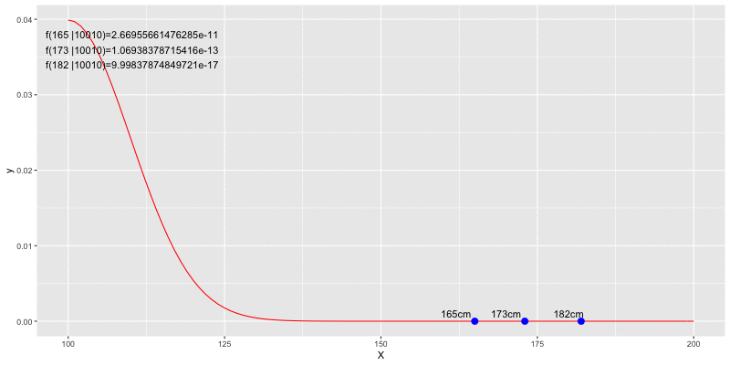

平均身長を推定したいとします。ある学級で身長を測定したところ，165cm,173cm,182cmの3人が観測されました。
標準偏差が10だと仮定し，これらのデータから考えられる尤度$L(165,173,182|\mu,10)$をイメージするプロットを描画します。

<!--more-->
```{r}
library(tidyverse)
```

### ３つのデータポイントでの尤度

####  muが170だとすると？

```{r likelihood}
datset <- c(165,173,182)
ggplot(data=data.frame(X=c(100,200)),aes(x=X))+
  stat_function(fun=dnorm,args = list(mean=170,sd=10),color="red")+
  geom_segment(aes(x = datset[1], xend = datset[1], y = 0, yend = dnorm(datset[1], 170, 10)), lty = 2) +
  geom_segment(aes(x = datset[2], xend = datset[2], y = 0, yend = dnorm(datset[2], 170, 10)), lty = 2) +
  geom_segment(aes(x = datset[3], xend = datset[3], y = 0, yend = dnorm(datset[3], 170, 10)), lty = 2) +
  geom_point(data=data.frame(X=datset,Y=rep(0,3)),aes(x=X,y=Y),size=3,color="blue") + 
  annotate("text", x=162,   y=0.001, label="165cm")+
  annotate("text", x=170,   y=0.001, label="173cm")+
  annotate("text", x=180,   y=0.001, label="182cm")
```

####  muが190だとすると？
```{r likelihood2}
ggplot(data=data.frame(X=c(100,200)),aes(x=X))+
  stat_function(fun=dnorm,args = list(mean=190,sd=10),color="red")+
  geom_segment(aes(x = datset[1], xend = datset[1], y = 0, yend = dnorm(datset[1], 190, 10)), lty = 2) +
  geom_segment(aes(x = datset[2], xend = datset[2], y = 0, yend = dnorm(datset[2], 190, 10)), lty = 2) +
  geom_segment(aes(x = datset[3], xend = datset[3], y = 0, yend = dnorm(datset[3], 190, 10)), lty = 2) +
  geom_point(data=data.frame(X=datset,Y=rep(0,3)),aes(x=X,y=Y),size=3,color="blue")+
  annotate("text", x=162,   y=0.001, label="165cm")+
  annotate("text", x=170,   y=0.001, label="173cm")+
  annotate("text", x=180,   y=0.001, label="182cm")
```

####  muが190だとすると？
```{r likelihood3}
ggplot(data=data.frame(X=c(100,200)),aes(x=X))+
  stat_function(fun=dnorm,args = list(mean=160,sd=10),color="red")+
  geom_segment(aes(x = datset[1], xend = datset[1], y = 0, yend = dnorm(datset[1], 160, 10)), lty = 2) +
  geom_segment(aes(x = datset[2], xend = datset[2], y = 0, yend = dnorm(datset[2], 160, 10)), lty = 2) +
  geom_segment(aes(x = datset[3], xend = datset[3], y = 0, yend = dnorm(datset[3], 160, 10)), lty = 2) + 
  geom_point(data=data.frame(X=datset,Y=rep(0,3)),aes(x=X,y=Y),size=3,color="blue")+
  annotate("text", x=162,   y=0.001, label="165cm")+
  annotate("text", x=170,   y=0.001, label="173cm")+
  annotate("text", x=180,   y=0.001, label="182cm")
```


### 平均値を動かすのは平行移動

正規分布が平行移動するのアニメーションを作るコードは次の通り。

animationパッケージとimage magickを別途ご用意ください。

```{r animation}
library(animation)

ani.options(interval=0.1)
ani.options(loop=0)
ani.options(ani.width=800,ani.height=400)

likelihood_movie <- function(datset,fromX,toX){
  for(i in seq(fromX,toX,1)){
    g <- ggplot(data=data.frame(X=c(fromX,toX)),aes(x=X))+
      stat_function(fun=dnorm,args = list(mean=i,sd=10),color="red")+
      geom_segment(aes(x = datset[1], xend = datset[1], y = 0, yend = dnorm(datset[1], i, 10)), lty = 2) +
      geom_segment(aes(x = datset[2], xend = datset[2], y = 0, yend = dnorm(datset[2], i, 10)), lty = 2) +
      geom_segment(aes(x = datset[3], xend = datset[3], y = 0, yend = dnorm(datset[3], i, 10)), lty = 2) + 
      geom_point(data=data.frame(X=datset,Y=rep(0,3)),aes(x=X,y=Y),size=3,color="blue")+
      annotate("text", x=162,   y=0.001, label="165cm")+
      annotate("text", x=170,   y=0.001, label="173cm")+
      annotate("text", x=180,   y=0.001, label="182cm")+
      annotate("text", x=110,   y=0.038, label=paste0(" f(165 |",i,"10)=",dnorm(165,i,10)))+
      annotate("text", x=110,   y=0.036, label=paste0(" f(173 |",i,"10)=",dnorm(173,i,10)))+
      annotate("text", x=110,   y=0.034, label=paste0(" f(182 |",i,"10)=",dnorm(182,i,10)))
    
    print(g)
  }
}

saveGIF(likelihood_movie(datset=c(165,173,182),fromX=100,toX=200), 
        movie.name="likelihood.gif",clean=T)
```

出来上がった図がこちら。

